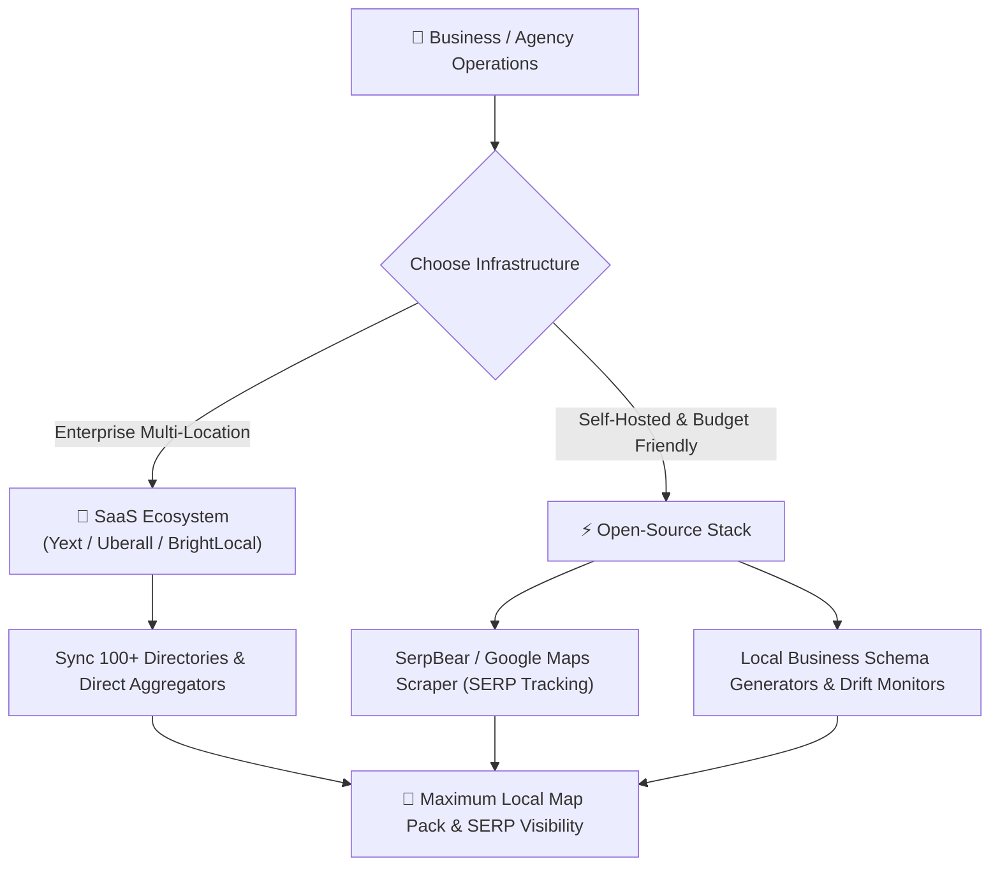

# 🚀 Awesome Local SEO Platform 📍

  
  
  
  
  
  

## 🌟 Top Local SEO Platforms & Software Ecosystem

**A Curated List of Premier SaaS Products & Open-Source GitHub Projects for Local Search Optimization**

*Focused on Local Rank Tracking, Citation Building, Google Business Profile (GBP) Management, Geo-Grid Heatmaps, Local Pack Visibility, & Review Management.*

---

## 📌 Table of Contents

- [🌐 Local SEO Industry Market Overview](#-local-seo-industry-market-overview)
- [💼 SaaS/Hosted Local SEO Platforms](#-saashosted-local-seo-platforms)
- [⚡ Open-Source GitHub Projects](#-open-source-github-projects)
- [🛠️ Hybrid Local SEO Architecture](#%EF%B8%8F-hybrid-local-seo-architecture)
- [🤝 How to Contribute](#-how-to-contribute)
- [💖 Support & Sponsorship](#-support--sponsorship)
- [📈 Star History](#-star-history)
- [⚠️ Disclaimer](#%EF%B8%8F-disclaimer)

---

## 🌐 Local SEO Industry Market Overview

> 📊 **Market Size & Structure**: The global **Local SEO and Location Marketing Software Market** is estimated at **$1.8 Billion – $2.4 Billion** (growing at a ~15.2% CAGR). The sector is **moderately fragmented**: enterprise listing networks (such as Yext, Semrush, and Uberall) lead multi-location data syndication, while specialized agency toolkits and geo-grid rank trackers (BrightLocal, Local Falcon, Whitespark) capture niche service-area operations.

---

## 💼 SaaS/Hosted Local SEO Platforms

The table below outlines top commercial SaaS local SEO suites. *Sorted descending by estimated company size / valuation / annual revenue.*

| 🏢 Product / Platform | 📝 Description & Key Capabilities | 💵 Starting Pricing | 🎁 Free Tier / Trial Limits | 📊 Company Scale (Revenue / Valuation) |
| :--- | :--- | :--- | :--- | :--- |
| **[Yext](https://www.yext.com/)** | Enterprise location knowledge management, direct publisher listings network, and real-time multi-location sync across 200+ global directories. | **$19.00/week** (~$79/month billed annually for Emerging plan) | 14-day free trial & free local listing scan tool | **~$400M ARR** (Public: NYSE: YEXT, ~$800M+ Market Cap) |
| **[Semrush Local](https://www.semrush.com/)** | All-in-one digital marketing suite with dedicated listing distribution, local rank tracking, and Google Business Profile audit capabilities. | **$139.95/month** (Pro plan base; Local listing add-on from $20/mo) | 7-day full feature free trial with basic audit tools | **~$350M ARR** (Public: NYSE: SEMR, ~$1.4B Market Cap) |
| **[Uberall](https://uberall.com/)** | Enterprise location marketing and reputation platform tailored for multi-location brands, franchises, and global local listings. | **$125.00/month** (Base tier per location) | 14-day free trial & free online presence audit scan | **~$100M ARR** ($115M+ total venture funding) |
| **[Moz Local](https://moz.com/products/local)** | Automated directory submission and listing consistency monitor designed to clean up duplicate business profiles across aggregators. | **$14.00/month** ($169/year per location) | Free Local Presence Check tool for up to 10 directory listings | **~$70M ARR** (Acquired by Ziff Davis / iContact) |
| **[BrightLocal](https://www.brightlocal.com/)** | Agency-focused local SEO suite offering citation building, local SERP rank tracking, Google Business Profile insights, and white-label reporting. | **$39.00/month** (Track plan, billed monthly) | 14-day free trial (No credit card required, up to 3 locations) | **~$35M ARR** (Bootstrapped & profitable, 100+ team members) |
| **[Synup](https://synup.com/)** | Listing distribution, voice search optimization, and automated customer review management platform for agencies and brand networks. | **$34.00/month** (Per location tier) | 14-day free trial & free Google Business Profile audit scan | **~$20M ARR** ($20M+ total venture funding) |
| **[Rio SEO](https://www.rioseo.com/)** | Local search automation platform delivering enterprise local landing pages, directory distribution, and local rank tracking. | **$150.00/month** (Enterprise base per location) | 14-day demo environment & free local search health audit | **~$20M ARR** (Acquired by Press Ganey) |
| **[Whitespark](https://whitespark.ca/)** | Specialist local SEO toolkit renowned for deep local citation discovery, review generation, and local search position tracking. | **$16.00/month** (Local Citation Finder, billed annually) | Free Account available (3 citation searches/day, 1 project limit) | **~$10M ARR** (~30 team members) |
| **[GeoRanker](https://www.georanker.com/)** | Real-time geo-located rank tracker and SERP API supporting local pack monitoring, heatmaps, and competitive intelligence. | **$99.00/month** (Pro plan base) | Free Account available (10 credits/month & 14-day full trial) | **~$3M ARR** |
| **[Local Falcon](https://www.localfalcon.com/)** | Pioneer in visual geo-grid local rank tracking, providing interactive Map Pack visibility heatmaps across customizable grid radii. | **$24.99/month** (Starter plan with 7,500 credits/month) | Free Account with 100 bonus scan credits upon registration | **~$3M ARR** |

---

## ⚡ Open-Source GitHub Projects

Below are top open-source projects for self-hosted rank tracking, Google Maps scrapers, local SERP APIs, and schema tools. *Sorted descending by GitHub Stars_Count.*

1. **[omkarcloud/google-maps-scraper](https://github.com/omkarcloud/google-maps-scraper)**   
   🗺️ *High-performance Google Maps scraper and lead generator. Extracts 50+ data points including business details, phone numbers, emails, ratings, and reviews.*

2. **[towfiqi/serpbear](https://github.com/towfiqi/serpbear)**   
   🐻 *Open-source, self-hosted rank tracking web application. Track unlimited keywords, domains, and SERP positions using BYO proxy or SERP data APIs.*

3. **[serpapi/google-search-results-python](https://github.com/serpapi/google-search-results-python)**   
   🐍 *Official Python client library to scrape Google Search, Google Local Pack, and Google Maps SERP results with structured JSON outputs.*

4. **[AgriciDaniel/flow](https://github.com/AgriciDaniel/flow)**   
   🌊 *Evidence-led SEO and local search playbook tailored for the AI-search era (GEO, Perplexity, Gemini, ChatGPT, and Local Map Packs).*

5. **[danishfareed/Google-Maps-SERP](https://github.com/danishfareed/Google-Maps-SERP)**   
   📍 *Open-source Google Maps SERP rank checker utility for analyzing local pack position visibility across targeted geo-coordinates.*

6. **[AgriciDaniel/local-competitor-map](https://github.com/AgriciDaniel/local-competitor-map)**   
   🗺️ *AI-powered local competitor intelligence tool that visualizes local business rivals on a photorealistic Google 3D map environment.*

7. **[IamRamgarhia/All-In-One-Free-SEO-Tool](https://github.com/IamRamgarhia/All-In-One-Free-SEO-Tool)**   
   🧰 *Self-hosted, open-source alternative to Ahrefs, Semrush, and Moz containing 99+ SEO utilities including rank tracking and local audit modules.*

8. **[dancolta/seo-drift-monitor](https://github.com/dancolta/seo-drift-monitor)**   
   🛡️ *Automated SEO contract monitor that alerts on unintended canonical, noindex, and LocalBusiness schema markup changes across deployments.*

9. **[GreatStackDev/seo-rank-tracker](https://github.com/GreatStackDev/seo-rank-tracker)**   
   📊 *Modern open-source keyword rank tracker and SEO analyzer interface built with React.js and Tailwind CSS.*

---

## 🛠️ Hybrid Local SEO Architecture

---

## 🤝 How to Contribute

Contributions are welcome! Please follow these guidelines:

1. 🍴 **Fork** the repository.
2. 📝 Add or update tools in `README.md` following the tabular format for SaaS or Stars_Badge format for Open-Source.
3. 🔗 Include exact starting prices, free tier limits, company revenue/valuation details, or stargazers links.
4. 🚀 Submit a **Pull Request** with a brief summary of additions.

For list guidelines and meta resources, check out [Awesome-Awesome-Awesome](https://github.com/ishandutta2007/Awesome-Awesome-Awesome).

---

## 💖 Support & Sponsorship

If you find this curated Local SEO platform directory helpful, please consider supporting the project:

- ⭐ **Star** this repository to increase visibility.
- 🔀 **Fork** it to build your custom SEO toolset.
- 📢 **Share** it with fellow SEO specialists, digital marketing agencies, and developers.
- ☕ **Sponsor / Buy a Coffee**: Support ongoing maintenance via [GitHub Sponsors](https://github.com/sponsors/ishandutta2007).

---

## 📈 Star History

---

## ⚠️ Disclaimer

- This directory is a **community-curated list** provided for educational and analytical purposes.
- Local SEO software interacts with third-party directories, APIs, and search engine SERPs. Always ensure compliance with robots.txt, terms of service, and privacy regulations.
- Pricing, free trial terms, and company revenue estimates are subject to market changes and updated regularly.
